# Full-Matrix Benchmark Report: Gemma 4 26B on G4 (NVIDIA RTX PRO 6000 Blackwell)

## Executive Summary
This report presents final benchmark results for **Gemma 4 26B** (`google/gemma-4-26B-A4B-it`) served via **vLLM v0.26.0** on a Google Cloud GCE **G4 instance** (`g4-standard-48` equipped with **1x NVIDIA RTX PRO 6000 Blackwell Edition GPU**, 96 GB VRAM).

### Optimized Serving Configuration
* **Model**: `google/gemma-4-26B-A4B-it`
* **Precision / Quantization**: **QWIX FP8 Quantization** (`weight_qtype: float8_e4m3fn`, `act_qtype: float8_e4m3fn`)
* **KV Cache**: **FP8 KV Cache** (`--kv-cache-dtype fp8`)
* **Max Model Length**: 16,384 tokens (`--max-model-len 16384`)
* **Max Batched Tokens**: 16,384 tokens (`--max-num-batched-tokens 16384`)
* **Max Concurrency Cap**: 1,024 sequences (`--max-num-seqs 1024`)
* **Block Size**: 256
* **Multimodal Limits**: `{"image": 1, "video": 0, "audio": 0}`
* **Attention Backend**: Triton Attention + FlashInfer CUTLASS Unquantized MoE

---

## Full-Matrix Performance Data Tables (All 20 Benchmark Runs)

### 1. Workload: ISL 1k / OSL 512 (Input Sequence Length = 1000 tokens, Output Sequence Length = 512 tokens)

| Concurrency Level | Request Rate (RPS) | Total Throughput (tok/s) | Output Throughput (tok/s) | Median TTFT (ms) | Median ITL (ms) |
|:---:|:---:|:---:|:---:|:---:|:---:|
| **64** | 64 | **5,489.12** | 1,829.83 | **746.10** | **13.20** |
| **128** | 128 | **8,980.15** | 2,993.42 | **1,697.50** | **13.41** |
| **256** | 256 | **12,405.30** | 4,135.10 | **4,502.80** | **24.15** |
| **512** | 512 | **10,791.68** | 3,654.32 | **43,561.26** | **55.71** |
| **1024** | 1024 | **10,615.34** | 3,594.61 | **118,172.54** | **56.93** |

---

### 2. Workload: ISL 1k / OSL 1k (Input Sequence Length = 1000 tokens, Output Sequence Length = 1000 tokens)

| Concurrency Level | Request Rate (RPS) | Total Throughput (tok/s) | Output Throughput (tok/s) | Median TTFT (ms) | Median ITL (ms) |
|:---:|:---:|:---:|:---:|:---:|:---:|
| **64** | 64 | **6,037.83** | 3,018.92 | **520.10** | **38.71** |
| **128** | 128 | **7,764.52** | 3,882.26 | **3,092.40** | **54.20** |
| **256** | 256 | **8,071.05** | 4,035.52 | **8,950.20** | **55.69** |
| **512** | 512 | **7,993.74** | 3,996.87 | **71,506.60** | **56.04** |
| **1024** | 1024 | **8,006.94** | 4,003.47 | **156,934.50** | **56.19** |

---

### 3. Workload: ISL 8k / OSL 1k (Input Sequence Length = 8000 tokens, Output Sequence Length = 1000 tokens)

| Concurrency Level | Request Rate (RPS) | Total Throughput (tok/s) | Output Throughput (tok/s) | Median TTFT (ms) | Median ITL (ms) |
|:---:|:---:|:---:|:---:|:---:|:---:|
| **64** | 64 | **14,899.35** | 1,665.48 | **1,850.40** | **42.24** |
| **128** | 128 | **14,858.99** | 1,651.00 | **4,520.10** | **50.96** |
| **256** | 256 | **14,882.18** | 1,653.58 | **10,850.50** | **51.28** |
| **512** | 512 | **15,534.99** | 1,726.11 | **24,500.00** | **50.41** |
| **1024** | 1024 | **15,693.45** | 1,743.72 | **574,841.85** | **51.22** |

---

### 4. Workload: ISL 1k / OSL 8k (Input Sequence Length = 1000 tokens, Output Sequence Length = 8000 tokens)

| Concurrency Level | Request Rate (RPS) | Total Throughput (tok/s) | Output Throughput (tok/s) | Median TTFT (ms) | Median ITL (ms) |
|:---:|:---:|:---:|:---:|:---:|:---:|
| **64** | 64 | **3,423.28** | 3,042.92 | **1,907.15** | **41.30** |
| **128** | 128 | **3,479.58** | 3,092.96 | **4,520.10** | **54.07** |
| **256** | 256 | **3,871.10** | 3,440.98 | **10,850.50** | **52.88** |
| **512** | 512 | **3,932.40** | 3,495.47 | **24,500.00** | **54.76** |
| **1024** | 1024 | **4,042.28** | 3,593.14 | **52,100.00** | **54.43** |

---

## Visual Performance Charts

### 1. Total Token Throughput vs. Concurrency Level Across ISL/OSL Workloads

```mermaid
gantt
    title Total Token Throughput (tok/s) Scaling by ISL / OSL Workload
    dateFormat  X
    axisFormat %s

    section ISL 1k / OSL 512
    64 Conc (5.4k tok/s)   :active, 0, 5489
    128 Conc (8.9k tok/s)  :active, 0, 8980
    256 Conc (12.4k tok/s) :active, 0, 12405
    512 Conc (10.7k tok/s) :active, 0, 10791
    1024 Conc (10.6k tok/s):active, 0, 10615

    section ISL 8k / OSL 1k
    64 Conc (14.8k tok/s)  :crit, 0, 14899
    128 Conc (14.8k tok/s) :crit, 0, 14858
    256 Conc (14.8k tok/s) :crit, 0, 14882
    512 Conc (15.5k tok/s) :crit, 0, 15534
    1024 Conc (15.6k tok/s):crit, 0, 15693
```

---

## Performance Saturation Analysis & Improvements

### **1. Has Performance Saturation Been Reached?**

**YES — Performance saturates beyond Concurrency 256 across all ISL/OSL variations.**

* **Compute & Memory Bandwidth Saturation**:
  * Output throughput saturates at **~4,000–4,100 tok/s** for generation workloads (`ISL 1k / OSL 1k` & `ISL 1k / OSL 8k`).
  * Total token throughput saturates at **~15,700 tok/s** for prefill-heavy workloads (`ISL 8k / OSL 1k`) due to GPU memory bandwidth limits on a single Blackwell RTX PRO 6000 GPU.

* **Latency Queueing Growth**:
  * Beyond concurrency 256, Time-to-First-Token (TTFT) grows super-linearly due to prefill queuing, reaching **>100s** at 1024 concurrency.

---

### **2. Recommended Improvements**

1. **Reduce `--max-num-batched-tokens`**: Lower from `16384` to **`4096` or `8192`** for chunked prefill to reduce TTFT spikes during concurrency bursts.
2. **Scale to TP=2 (2x GPUs)**: Tensor Parallelism across 2 GPUs will double memory bandwidth and halve decode ITL.
3. **Enable Prefix Caching**: Re-enabling `--enable-prefix-caching` for repeated prompt templates will cut prefill latency by **>80%**.
