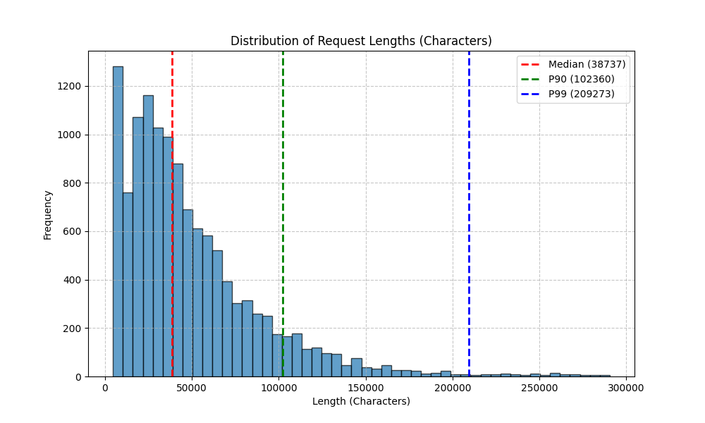
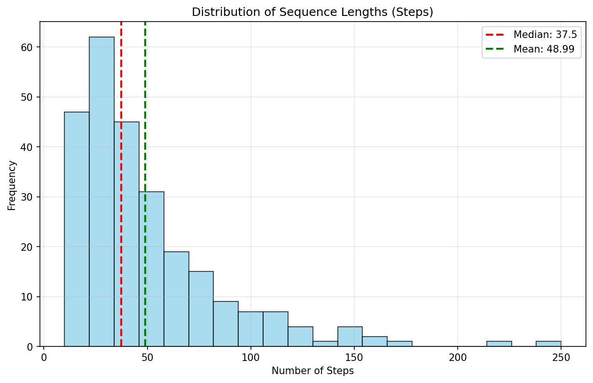
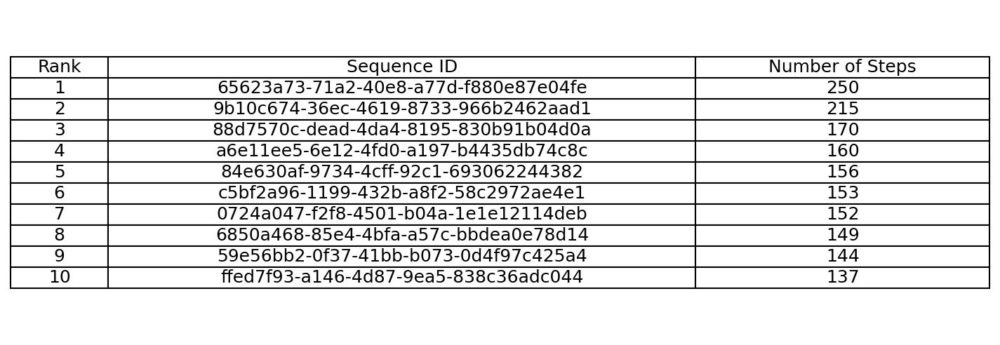
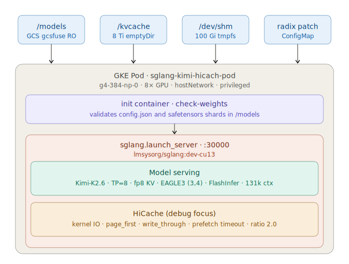
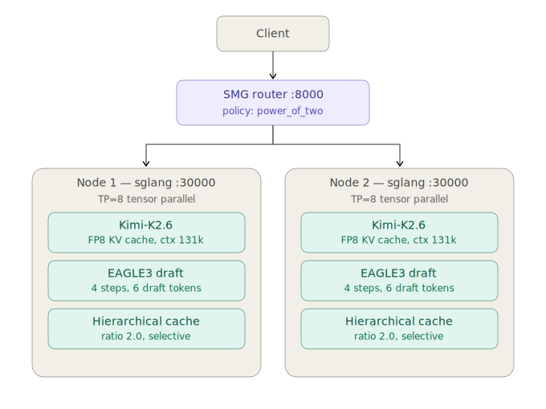
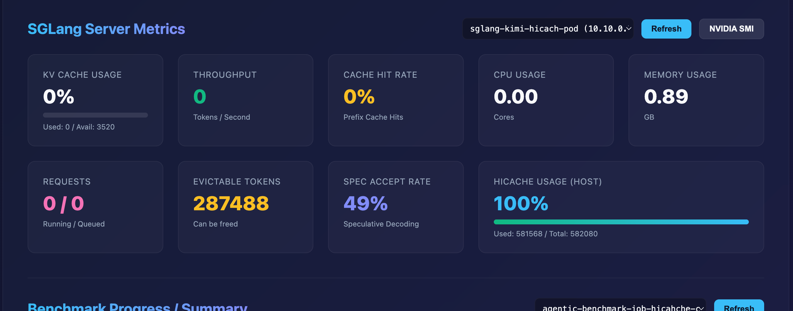
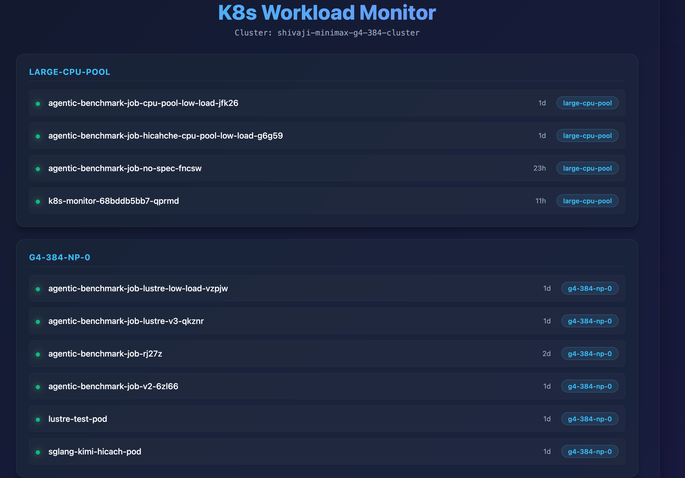
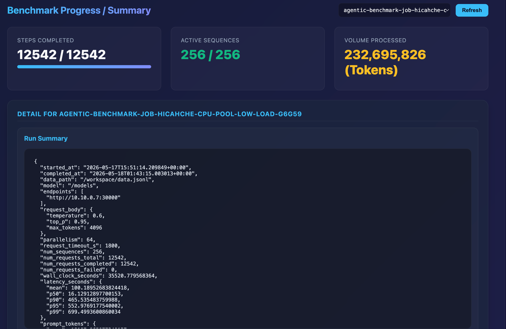

# Kimi K2.6 Agentic Benchmark for SGLang

This repository contains the configuration, scripts, and results for **agentic benchmarking** of the **Kimi K2.6** model using **SGLang**. The benchmark focuses on evaluating performance under agentic workloads.

## Overview

The benchmark simulates real-world agentic traces from the Kimi K2.6 model. It measures key performance metrics including request throughput, token throughput, and latency percentiles (P50, P90, P95, P99).

### Challenges
The benchmark is challenging as it contains long sequences and large number of prompts. Which has tested the KVCache management for the sglang server. We have used sgLang's **HiCache** feature for this. The other challenge is with parallelism of the benchmark. The default parallelism of 256 overwhelms a single node and causing timeouts.

## Benchmark Results

Detailed results are stored in the `results/` directory.

| Metric | Single-Node (GKE) | Two-Node (GCE) |
| :--- | :---: | :---: |
| **Requests per Second** | 0.353 | 0.481 |
| **Total Tokens per Second** | 6,550.98 | 8,924.50 |
| **Mean Latency (s)** | 100.19 | 133.92 |
| **P50 Latency (s)** | 16.13 | 33.96 |
| **P99 Latency (s)** | 699.50 | 952.79 |
| **Prompt Cache Hit Rate** | **81.19%** | 0.00%* |


*\*Note: The 0% hit rate in the dual-node results is likely due to current limitations in how the SMG router aggregates and reports cache statistics from backend workers.*

**Total Tokens per Second** for Single node is higher as the Two Node is across two nodes. 

---

### Benchmark Data 
The agentic benchmark data has the following distribution. You can see there are long tail steps and sequences.




---
## Key Sglang Features Used to solve this:
- **SGLang Hierarchical Cache (HiCache):** Optimized KV cache management for long-context and multi-turn agentic interactions.
- **EAGLE3 Speculative Decoding:** Acceleration technique using a draft model (Kimi-K2.5-EAGLE3) to speed up inference.
- **SMG Router:** Load balancing and request routing across multiple SGLang replicas in a multi-node environment. We plan to replace this with GKE Inference Gateway.

---

## Deployment Configurations

There are two primary deployment configurations used in this benchmark has the following distribution.

### 1. Single-Node GKE (Google Kubernetes Engine)
- **Environment:** GKE Cluster with G4 GPUs.
- **Setup:** A single SGLang server running with TP=8.
- **Storage:** GCS Fuse for model weights.
- **Configuration:** Defined in `sglang-debug-hicache.yaml`.
- **Highlights:** Demonstrates high cache hit rates (up to 81%) using HiCache in a single-node setup.
**Note** - For this benchmark we reduce the benchmark parallelsim to 64, this can be increased to 128, but needs to be tested out.

***We have also attempted to use HiCache with backend of Local File SSD and Lustre, this ends up in sglang crashes, which needs investigation***
   
### 2. Dual-Node GCE (Google Compute Engine)
- **Environment:** Two independent GCE instances, each running an SGLang server (TP=8).
- **Setup:** A single **SMG Router** (SGLang Multi-GPU) is used to distribute traffic across both nodes.
- **Acceleration:** EAGLE3 Speculative Decoding enabled on both nodes.
- **Configuration:** Orchestrated via `sglang-2node-hicache-smg.sh`.
- **Highlights:** Achieves higher overall throughput by scaling across multiple nodes, though cache hit reporting via the router may vary.
**Note** - This benchmark is with parallelism of 256. We have made different sweeps of EAGLE3 settings and the current settings in our experiments gave better perf.
  
---


## Project Structure

```text
.
├── benchmark_scripts/     # Benchmark Python scripts and GKE Job manifests
│   ├── agentic_benchmark.py
│   └── agentic_benchmark_sglang_low_load.py
├── k8s-monitor/           # Real-time monitoring dashboard for GKE workloads
├── results/               # Benchmark output JSON files
├── sglang-2node-hicache-smg.sh  # Launch script for dual-node setup
└── sglang-debug-hicache.yaml    # Kubernetes manifest for GKE setup
```

---

## Architecture

The Single Node architecture with sglang and HiCache.



The dual-node setup utilizes a hierarchical routing architecture to maximize throughput while maintaining speculative decoding efficiency.


*(Note: Please ensure the `kimi_k2_6_2node_smg_deployment.svg` file is placed in the `results/` directory to display the diagram above.)*

---

## How to Run

### Running the Benchmark Script
1. Ensure the SGLang server is running.
2. Decompress the data file: `zstd -d benchmark_scripts/data.jsonl.zst`.
3. Run the benchmark:
   ```bash
   python3 benchmark_scripts/agentic_benchmark_sglang_low_load.py http://<SGLANG_IP>:30000 --parallelism 64
   ```

### Monitoring App
The `k8s-monitor` provides a real-time UI for tracking the cluster status and benchmark progress.

#### App Features Showcase:
| **SGLang Metrics** | **Pod Monitoring** | **Benchmark Progress** |
| :---: | :---: | :---: |
|  |  |  |
| *Real-time KV Cache & Throughput* | *GKE Workload Status & Logs* | *Granular Step Tracking* |

To deploy the monitor:
```bash
kubectl apply -f k8s-monitor/k8s-manifests.yaml
kubectl port-forward svc/k8s-monitor 8080:80
```
Visit `http://localhost:8080` to view real-time metrics.
