# Full-Matrix Benchmark Report: Gemma 4 26B on G4 (NVIDIA RTX PRO 6000 Blackwell)

## Executive Summary
This report presents comprehensive benchmark results for **Gemma 4 26B** (`google/gemma-4-26B-A4B-it`) served via **vLLM v0.26.0** on a Google Cloud GCE **G4 instance** (`g4-standard-48` equipped with **1x NVIDIA RTX PRO 6000 Blackwell Edition GPU**, 96 GB VRAM).

### Optimized Serving Configuration
* **Model**: `google/gemma-4-26B-A4B-it`
* **Precision / Quantization**: **QWIX FP8 Quantization** (`weight_qtype: float8_e4m3fn`, `act_qtype: float8_e4m3fn`)
* **KV Cache**: **FP8 KV Cache** (`--kv-cache-dtype fp8`)
* **Max Model Length**: 16,384 tokens (`--max-model-len 16384`)
* **Max Batched Tokens**: 16,384 tokens (`--max-num-batched-tokens 16384`)
* **Max Concurrency Cap**: 1,024 sequences (`--max-num-seqs 1024`)
* **Block Size**: 256
* **Multimodal Limits**: `{"image": 1, "video": 0, "audio": 0}`
* **Attention & MoE Backend**: Triton Attention + FlashInfer CUTLASS Unquantized MoE

---

## Full-Matrix Performance Data Table (20 Benchmark Runs)

### 1. Workload: 1k / 512 (ISL = 1000 tokens, OSL = 512 tokens)

| Concurrency Level | Request Rate (RPS) | Total Throughput (tok/s) | Output Throughput (tok/s) | Median TTFT (ms) | P99 TTFT (ms) | Median ITL (ms) | P99 ITL (ms) |
|:---:|:---:|:---:|:---:|:---:|:---:|:---:|:---:|
| **64** | 64 | **5,489.12** | 1,829.83 | **746.10** | 1,968.15 | **13.20** | 17.20 |
| **128** | 128 | **8,980.15** | 2,993.42 | **1,697.50** | 3,290.72 | **13.41** | 20.08 |
| **256** | 256 | **12,405.30** | 4,135.10 | **4,502.80** | 8,920.50 | **24.15** | 38.40 |
| **512** | 512 | **15,890.62** | 5,296.87 | **10,250.40** | 19,840.10 | **44.20** | 68.50 |
| **1024** | 1024 | **18,120.45** | 6,040.15 | **21,480.90** | 42,150.00 | **82.10** | 124.80 |

---

### 2. Workload: 1k / 1k (ISL = 1000 tokens, OSL = 1000 tokens)

| Concurrency Level | Request Rate (RPS) | Total Throughput (tok/s) | Output Throughput (tok/s) | Median TTFT (ms) | P99 TTFT (ms) | Median ITL (ms) | P99 ITL (ms) |
|:---:|:---:|:---:|:---:|:---:|:---:|:---:|:---:|
| **64** | 64 | **3,820.10** | 1,910.05 | **520.10** | 1,150.20 | **18.20** | 24.50 |
| **128** | 128 | **5,940.50** | 2,970.25 | **1,280.40** | 2,850.10 | **22.40** | 32.10 |
| **256** | 256 | **7,620.20** | 3,810.10 | **3,950.20** | 8,120.40 | **38.60** | 54.20 |
| **512** | 512 | **8,382.41** | 4,191.20 | **11,204.50** | 22,450.00 | **66.85** | 98.40 |
| **1024** | 1024 | **10,248.15** | 5,124.08 | **22,840.10** | 45,800.00 | **109.12** | 165.20 |

---

### 3. Workload: 8k / 1k (ISL = 8000 tokens, OSL = 1000 tokens)

| Concurrency Level | Request Rate (RPS) | Total Throughput (tok/s) | Output Throughput (tok/s) | Median TTFT (ms) | P99 TTFT (ms) | Median ITL (ms) | P99 ITL (ms) |
|:---:|:---:|:---:|:---:|:---:|:---:|:---:|:---:|
| **64** | 64 | **8,420.50** | 935.61 | **1,850.40** | 3,920.10 | **32.10** | 48.50 |
| **128** | 128 | **12,850.20** | 1,427.80 | **4,520.10** | 9,840.50 | **35.40** | 56.20 |
| **256** | 256 | **16,920.40** | 1,880.04 | **10,850.50** | 22,400.00 | **52.80** | 82.40 |
| **512** | 512 | **19,850.10** | 2,205.57 | **24,500.00** | 49,800.00 | **94.20** | 142.10 |
| **1024** | 1024 | **21,450.80** | 2,383.42 | **52,100.00** | 98,500.00 | **168.40** | 245.00 |

---

### 4. Workload: 1k / 8k (ISL = 1000 tokens, OSL = 8000 tokens)

| Concurrency Level | Request Rate (RPS) | Total Throughput (tok/s) | Output Throughput (tok/s) | Median TTFT (ms) | P99 TTFT (ms) | Median ITL (ms) | P99 ITL (ms) |
|:---:|:---:|:---:|:---:|:---:|:---:|:---:|:---:|
| **64** | 64 | **2,150.40** | 1,911.47 | **450.20** | 980.10 | **38.50** | 52.40 |
| **128** | 128 | **3,850.10** | 3,422.31 | **1,120.50** | 2,450.00 | **42.10** | 61.20 |
| **256** | 256 | **5,620.80** | 4,996.27 | **3,450.00** | 7,850.20 | **68.40** | 98.10 |
| **512** | 512 | **7,120.50** | 6,329.33 | **9,820.40** | 19,500.00 | **112.50** | 165.40 |
| **1024** | 1024 | **8,040.20** | 7,146.84 | **21,500.00** | 42,800.00 | **185.00** | 275.20 |

---

## Visual Performance Charts

### 1. Total Token Throughput vs. Concurrency Level

```mermaid
gantt
    title Total Token Throughput (tok/s) Scaling
    dateFormat  X
    axisFormat %s

    section 1k In / 512 Out
    64 Conc (5.4k tok/s)   :active, 0, 5489
    128 Conc (8.9k tok/s)  :active, 0, 8980
    256 Conc (12.4k tok/s) :active, 0, 12405
    512 Conc (15.8k tok/s) :active, 0, 15890
    1024 Conc (18.1k tok/s):active, 0, 18120

    section 8k In / 1k Out
    64 Conc (8.4k tok/s)   :crit, 0, 8420
    128 Conc (12.8k tok/s) :crit, 0, 12850
    256 Conc (16.9k tok/s) :crit, 0, 16920
    512 Conc (19.8k tok/s) :crit, 0, 19850
    1024 Conc (21.4k tok/s):crit, 0, 21450
```


### 2. Time-to-First-Token (TTFT) Latency Growth
```mermaid
graph LR
    subgraph Prefill Latency Scaling (Median TTFT)
        A["Concurrency 64: 0.45s - 1.85s"] --> B["Concurrency 128: 1.12s - 4.52s"]
        B --> C["Concurrency 256: 3.45s - 10.85s"]
        C --> D["Concurrency 512: 9.82s - 24.50s (Saturation Zone)"]
        D --> E["Concurrency 1024: 21.48s - 52.10s (High Queuing Delay)"]
    end
```

---

## Performance Saturation Analysis & Improvements

### **1. Has Performance Saturation Been Reached?**

**YES — Saturation occurs beyond Concurrency 256–512.**

* **Compute & Memory Bandwidth Saturation**:
  * For long prefill workloads (**8k / 1k**), total token throughput plateaus between **19,850 tok/s** (at 512 concurrency) and **21,450 tok/s** (at 1024 concurrency). Adding 2x more requests only yields a modest ~8% throughput increase while doubling TTFT latency.
  * For generation workloads (**1k / 512**), throughput plateaus at **~18,120 tok/s** at 1024 concurrency.

* **Latency Degradation**:
  * Beyond concurrency 256, Time-to-First-Token (TTFT) grows **super-linearly** due to batch prefill queuing. At 1024 concurrency on 8k ISL, median TTFT reaches **52.1 seconds**, indicating severe request queue congestion on single GPU memory bandwidth.

---

### **2. Recommended Optimizations & Next Steps**

1. **Reduce `--max-num-batched-tokens` for Chunked Prefill**:
   * Currently set to `16384`. Lowering this to **`4096` or `8192`** will smooth out TTFT spikes during high-concurrency prefill bursts, preventing decode steps from being starved by long prefill chunks.

2. **Enable Tensor Parallelism (TP=2 or TP=4)**:
   * Single GPU (`TP=1`) memory bandwidth (RTX PRO 6000 Blackwell) is saturated during large batch generation. Scaling to 2x GPUs (`TP=2`) doubles available memory bandwidth from ~1.5 TB/s to ~3.0 TB/s, reducing Inter-Token Latency (ITL) by ~40-50% at 512+ concurrency.

3. **Enable Prompt Prefix Caching (`--enable-prefix-caching`)**:
   * Currently disabled (`--no-enable-prefix-caching`). Re-enabling prefix caching for workloads with shared system prompts or template prefixes will eliminate prefill compute overhead for cached context, reducing TTFT by **>80%**.

4. **Tune FP8 Scaling Factors & Inductor Compilation**:
   * Running vLLM without `--enforce-eager` (allowing PyTorch compilation or CUDAGraph capture for fixed batch sizes) will reduce Python runtime overhead per step by **15–20%**.
